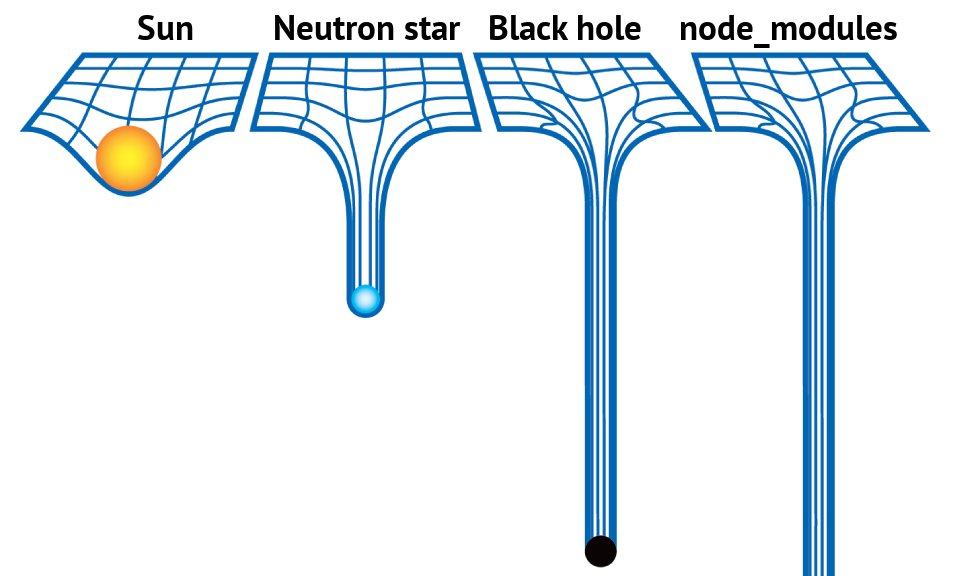
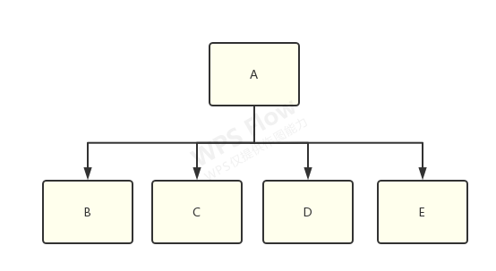
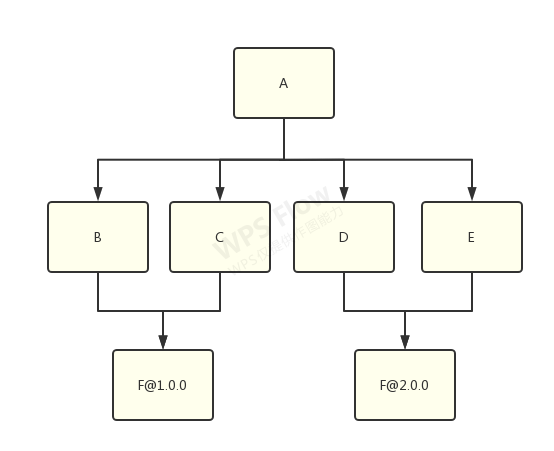
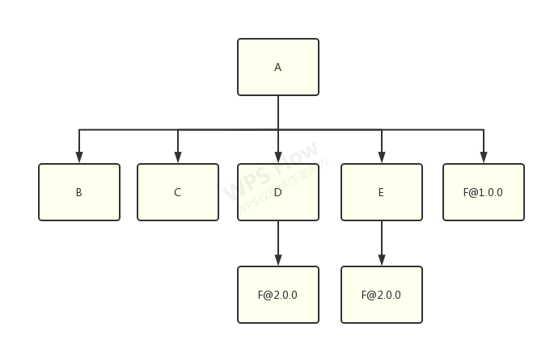
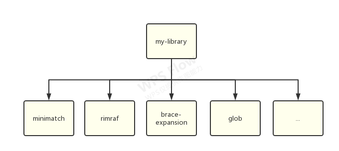
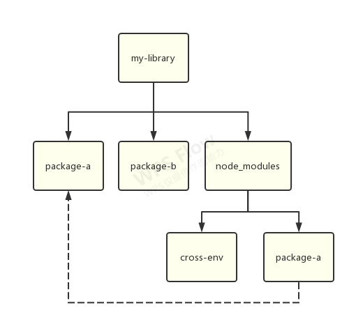

<!-- more -->

## 在没有包管理器之前

## NPM v1-v2

2009 年，NodeJS 诞生，NPM 的雏形也正在酝酿。

2011 年，NPM 发布了 1.0 版本。

初版 NPM 带来的文件结构，是嵌套结构：

```
node_modules
└─ foo
   ├─ index.js
   ├─ package.json
   └─ node_modules
      └─ bar
         ├─ index.js
         └─ package.json
```

我们可以在代码中通过 `require` 或 `import` 导入包。

一切都很美好，除了...



图来自：[https://github.com/tj/node-prune](https://github.com/tj/node-prune)

### node_modules 体积过大

显而易见的问题。这种形式的结构很快就能把磁盘占满。`rm -rf node_modules` 成为了前端程序员最常用的命令之一。

### node_modules 嵌套层级过深

只有当找到一片不依赖任何第三方包的叶子时，这棵树才能走到尽头。因此 node_modules 的嵌套深度十分可怕。

具体到实际的问题，相信早期 NPM 的 windows 用户都见过这个弹窗：


（node_modules 文件夹无法删除，因为超过了 windows 能处理的最大路径长度）

## Yarn & NPM v3

2016 年，yarn 诞生了。yarn 解决了 npm 几个最为迫在眉睫的问题：

1. 安装太慢（加缓存、多线程）
2. 目录嵌套（扁平化）
3. 无依赖锁（yarn.lock）

yarn 带来对的扁平化结构：

```
node_modules
├─ foo
|  ├─ index.js
|  └─ package.json
└─ bar
   ├─ index.js
   └─ package.json
```

扁平化后，实际需要安装的包数量大大减少，再加上 Yarn 首发的缓存机制，因此依赖的安装速度也得到了**史诗级**提升。

### 依赖锁

相比于扁平化结构，可以说 yarn 更大的贡献是发明了 yarn.lock。而 NPM 在一年后的 v5 才跟上了脚步，发布了 package-lock.json。

在没有依赖锁的年代，即使没有改动任何一行代码，一次 `npm install` 带来的实际代码量变更很可能是非常巨大的。 因为 NPM 采用 [语义化版本](https://semver.org/lang/zh-CN/) 约定，简单来说，`a.b.c` 代表着：

1. `a` 主版本号：当你做了不兼容的 API 修改
2. `b` 次版本号：当你做了向下兼容的功能性新增
3. `c` 修订号：当你做了向下兼容的问题修正

问题在于，这只是一个理想化的“约定”，具体到每个包有没有遵守，遵守得好不好，不是为我们所控的。 而默认情况下安装依赖时，得到的版本号是类似 `^1.0.0` 这样的。这个语法代表着将安装主版本号为 `1` 的最新版本。

虽然可以通过去掉一级依赖的 `^` 指定精确版本，但是无法指定二级、三级依赖的精确版本号，因此安装依然存在非常大的不确定性。

因此，为了解决这个问题，Yarn 提出了“锁”的解决方案：精确地将版本号锁定在一个值，并且在安装时通过计算哈希值校验文件一致性，从而保证每次构建使用的依赖都是完全一致的。

一个 yarn.lock 文件示例片段：

```
# THIS IS AN AUTOGENERATED FILE. DO NOT EDIT THIS FILE DIRECTLY.
# yarn lockfile v1


"@babel/code-frame@7.12.11":
  version "7.12.11"
  resolved "https://registry.npmmirror.com/@babel/code-frame/download/@babel/code-frame-7.12.11.tgz?cache=0&sync_timestamp=1633553739126&other_urls=https%3A%2F%2Fregistry.npmmirror.com%2F%40babel%2Fcode-frame%2Fdownload%2F%40babel%2Fcode-frame-7.12.11.tgz#f4ad435aa263db935b8f10f2c552d23fb716a63f"
  integrity sha1-9K1DWqJj25NbjxDyxVLSP7cWpj8=
  dependencies:
    "@babel/highlight" "^7.10.4"

"@babel/code-frame@^7.0.0", "@babel/code-frame@^7.14.5", "@babel/code-frame@^7.15.8":
  version "7.15.8"
  resolved "https://registry.npmmirror.com/@babel/code-frame/download/@babel/code-frame-7.15.8.tgz?cache=0&sync_timestamp=1633553739126&other_urls=https%3A%2F%2Fregistry.npmmirror.com%2F%40babel%2Fcode-frame%2Fdownload%2F%40babel%2Fcode-frame-7.15.8.tgz#45990c47adadb00c03677baa89221f7cc23d2503"
  integrity sha1-RZkMR62tsAwDZ3uqiSIffMI9JQM=
  dependencies:
    "@babel/highlight" "^7.14.5"
    
// more...
```

### “双胞胎陌生人”问题

这个词在英文中是 doppelgangers，意思是它们长得很像，但是除此以外又完全没有其它的关联。


想象一下有一个 library-a，它同时依赖了 library-b、c、d、f：



而 b 和 c 依赖了 f@1.0.0，d 和 e 依赖了 f@2.0.0：



这时候，node_modules 树需要做出选择了，到底是将 f@1.0.0 还是 f@2.0.0 扁平化，然后将另一个放到嵌套的 node_modules 中？

答案是：具体做那种选择将是**不确定的**，取决于哪一个 f 出现得更靠前，靠前的那个将被扁平化。

举例，将 f@1.0.0 扁平化的结果：



将 f@2.0.0 扁平化的结果：


无论如何，这个选择必须做，我们必然会在 node_modules 中拥有多份的 library-f，窘境将是无法避免的。因此它们也就成为了“双胞胎陌生人”。

其它编程语言没有这种问题，这是 NodeJS & NPM 独有的。 这种问题会造成：

1. 安装更慢
2. 耗费的磁盘空间更大
3. 某些只能存在单例的库（比如 React 或 Vue）如果被同时安装了两个版本则会出现问题
4. 当使用依赖 f 使用了 TypeScript 时会造成 .d.ts 文件混乱，导致编译器报错
5. 假设 f 有一个依赖 g，项目里也存在 g 的“双胞胎陌生人”，那么根据 NodeJS 的依赖查找原则（从当前目录逐级向上查找），两个 f 有可能会检索到不同版本的 g，这可能导致高度混乱的编译器错误。

### 幽灵依赖


假设我们有以下依赖：

```
{
  "name": "my-library",
  "version": "1.0.0",
  "main": "lib/index.js",
  "dependencies": {
    "minimatch": "^3.0.4"
  },
  "devDependencies": {
    "rimraf": "^2.6.2"
  }
}
```

理论上来说，我们项目的代码中可以使用的依赖只有 minimatch。但是实际上，以下代码也能运行：

```
var minimatch = require("minimatch")
var expand = require("brace-expansion");  // ???
var glob = require("glob")  // ???

// ???
```

这是因为扁平化结构将一些没有直接依赖的包也提升到了 node_modules 的一级目录，但是 NodeJS 并没有对其校验。所以引用它们也不会报错。




这种情况带来的问题：

1. 在没有显式指定“间接依赖”的版本号的时候，如果它被依赖到它的包做了大版本升级，存在不兼容的 API 变更，那么应用代码很可能就会跑不起来
2. 没有显式指定依赖带来的额外管理成本

### Workspace

Yarn 1.0 带来的另一个特性是 workspace，也是 monorepo 能够发展起来的一个重要原因。

假设我们有一个 workspace-a，它依赖了 cross-env：

```json
{
  "name": "package-a",
  "version": "1.0.0",

  "dependencies": {
    "cross-env": "5.0.5"
  }
}
```

还有一个 package-b，它依赖了 cross-env 和 package-a：

```json
{
  "name": "package-b",
  "version": "1.0.0",

  "dependencies": {
    "cross-env": "5.0.5",
    "workspace-a": "1.0.0"
  }
}
```

那么这时候在使用 workspace 模式安装的话，将得到以下结构：



其中，node_modules 中的 package-a 只是实际文件的链接。也就是说，Yarn workspace 模式可以将项目底下的子项目的依赖提升到根目录来进行扁平化安装，这样可以节省更多的磁盘空间，带来更快的安装效率，也可以使得项目管理更方便。

**但是**，结合上面所提到的两个问题，workspace 带来的问题只会更多，不会更少。这里就不详细展开了，[应用级 Monorepo 优化方案](https://segmentfault.com/a/1190000040291971)  这篇文章总结得很好。

## PNPM

