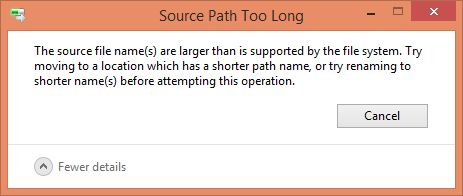

<!-- more -->

## 在没有包管理器之前

## NPM v1-v2

2009 年，NodeJS 诞生，NPM 的雏形也正在酝酿。

2011 年，NPM 发布了 1.0 版本。

初版 NPM 带来的文件结构，是嵌套结构：

```
node_modules
└─ foo
   ├─ index.js
   ├─ package.json
   └─ node_modules
      └─ bar
         ├─ index.js
         └─ package.json
```

我们可以在代码中通过 `require` 或 `import` 导入包。

一切都很美好，除了...


图来自：[https://github.com/tj/node-prune](https://github.com/tj/node-prune)

### node_modules 体积过大

显而易见的问题。这种形式的结构很快就能把磁盘占满。`rm -rf node_modules` 成为了前端程序员最为常用的命令之一。

### node_modules 嵌套层级过深

只有当找到一片不依赖任何第三方包的叶子时，这棵树才能走到尽头。因此 node_modules 的嵌套深度十分可怕。

具体到实际的问题，相信早期 NPM 的 windows 用户都见过这个弹窗：



（node_modules 文件夹无法删除，因为超过了 windows 能处理的最大路径长度）

## Yarn & NPM v3

2016 年，yarn 诞生了。yarn 解决了 npm 两个最为迫在眉睫的问题：

1. 目录嵌套
2. 无依赖锁

yarn 带来对的扁平化结构：

```
node_modules
├─ foo
|  ├─ index.js
|  └─ package.json
└─ bar
   ├─ index.js
   └─ package.json
```

因为扁平化后，实际需要安装的包数量大大减少，因此依赖的安装速度也得到了史诗级提升。

但是......

### “双胞胎陌生人”问题

这个词用英文表述是 doppelgangers，意思是它们长得很像，但是又完全没有除此以外的关联。


想象一下有一个 library-a，它同时依赖了 library-b、c、d、f：


而 b 和 c 依赖了 f@1.0.0，d 和 e 依赖了 f@2.0.0：


这时候，node_modules 树需要做出选择了，到底是将 f@1.0.0 还是 f@2.0.0 扁平化，然后将另一个放到嵌套的 node_modules 中？

答案是：具体做那种选择将是不确定的，取决于哪一个 f 出现得更靠前，靠前的那个将被扁平化。

举例，将 f@1.0.0 扁平化的结果：

```
- library-a/
  - package.json
  - node_modules/
    - library-b/
      - package.json
    - library-c/
      - package.json
    - library-d/
      - package.json
      - node_modules/
        - library-f/
          - package.json  <-- library-f@2.0.0
    - library-e/
      - package.json
      - node_modules/
        - library-f/
          - package.json  <-- library-f@2.0.0
    - library-f/
      - package.json  <-- library-f@1.0.0
```

无论如何，这个选择必须做，我们必然会在 node_modules 中拥有多份的 library-f，窘境将是无法避免的。因此它们也就成为了“双胞胎陌生人”。

这是 NodeJS & NPM 独有的问题，其它编程语言没有这种问题。

这种问题会造成：

1. 安装更慢
2. 耗费的磁盘空间更大
3. 某些只能存在单例的库（比如 React 或 Vue）如果被同时安装了两个版本则会出现问题
4. 当使用依赖 f 使用了 TypeScript 时会造成 .d.ts 文件混淆的问题，导致编译器报错
5. 假设 f 有一个依赖 g，项目里也存在 g 的“双胞胎陌生人”，那么根据 NodeJS 的依赖查找原则，两个 f 有可能会检索到不同版本的 g，这可能导致高度混乱的编译器错误。

### 幽灵依赖


假设我们有以下依赖：

```
{
  "name": "my-library",
  "version": "1.0.0",
  "main": "lib/index.js",
  "dependencies": {
    "minimatch": "^3.0.4"
  },
  "devDependencies": {
    "rimraf": "^2.6.2"
  }
}
```

理论上来说，我们项目的代码中可以使用的依赖只有 minimatch。但是实际上，以下代码也能运行：

```
var minimatch = require("minimatch")
var expand = require("brace-expansion");  // ???
var glob = require("glob")  // ???

// ???
```

这是因为扁平化结构将一些没有直接依赖的包也提升到了 node_modules 的一级目录，但是 NodeJS 并没有对其校验。所以引用它们也不会报错。

这种情况带来的问题：

1. 在没有显式指定“间接依赖”的版本号的时候，如果它被依赖到它的包做了大版本升级，那么应用代码很可能就会跑不起来
2. 没有显式指定依赖的额外管理成本

### yarn.lock & package-lock.json

相比于扁平化结构，可以说 yarn 更大的贡献是发明了 yarn.lock。而 NPM 在一年后的 v5 才跟上了脚步，发布了 package-lock.json。

在没有依赖锁的年代，即使没有改动任何一行代码，一次 `npm install` 带来的实际代码量变更很可能是非常巨大的。 因为 NPM 采用 [语义化版本](https://semver.org/lang/zh-CN/) 约定，简单来说，`a.b.c` 代表着：

1. `a` 主版本号：当你做了不兼容的 API 修改
2. `b` 次版本号：当你做了向下兼容的功能性新增
3. `c` 修订号：当你做了向下兼容的问题修正

问题在于，这是一个理想化的“约定”，具体到每个包有没有遵守，遵守得好不好，不是为我们所控的。 而默认情况下安装依赖时，得到的版本号是类似 `^1.0.0` 这样的。这个语法代表着将安装主版本号为 `1` 的最新版本。

虽然可以通过去掉一级依赖的 `^` 指定精确版本，但是无法指定二级、三级依赖的精确版本号，因此安装依然存在非常大的不确定性。

## PNPM

