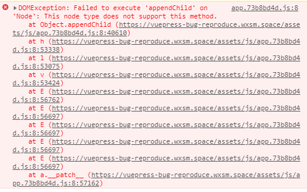

---

title: '记一次艰难的 Debug'
date: 2020-10-25T04:08:13.685Z
tags: []
---

<!-- 「」 -->

这是一次关于本博客的 Debug 经历，过程非常曲折。关键词：**Vue / SSR / 错配**。

不知道从哪篇博文开始，博客在直接从内页打开时，或者在内页刷新浏览器时，会报以下错误：

```
app.73b8bd4d.js:8
DOMException: Failed to execute 'appendChild' on 'Node': 
This node type does not support this method.
```

该错误：

1. 只会在 build 模式出现；
1. 只会在发布上 GitHub Pages 后出现；
1. 只会在某些博文中出现；
1. 只会在直接从链接进入该博文，或者在该博文页面刷新时出现。

该错误带来的影响，**会导致页面上的所有 JavaScript 功能全部失效**，具体来说是与 Vue.js 相关的功能。如：导航链接（因为使用了 Vue-Router），评论框，一些依赖于 Vue.js 的 VuePress 插件，等等。

<!-- more -->



## 主题？

初次看到这个报错时，我的第一想法是：是不是我不经意间在哪里调用了 `appendChild` 这个方法导致的？因为我的博客使用了我自己发布的主题，有可能是我哪个地方写得不好导致了这个问题。

但是，再三检查主题代码 [vuepress-theme-mini](https://github.com/wxsms/vuepress-theme-mini) 后，我并没有发现任何可疑之处。

实际上我也不太相信这个错误是由我的主题导致的，因为查看错误抛出处的源码时发现这些代码都不像是我写的。

## 插件？

另一个可疑之处，则是插件。具体来说，是以下 3 个插件：

1. `valine` 用于展示评论
1. `vuepress-plugin-flowchart` 用于绘制流程图
1. `vuepress-plugin-right-anchor` 用于显示浮动的目录

我 Google 了很多次，最后在 [vuepress/issues/1692](https://github.com/vuejs/vuepress/issues/1692) 里，有一句话引起了我的注意：

> Just a hint: Another common mistake is to use dynamic vue components that should render client side but forget to ignore them in static builds... 99% of those issues in our projects were missing `<ClientOnly>`. So try:
> ```html
> <ClientOnly>
>   <NonSSRFriendlyComponent/>
> </ClientOnly>
> ```

这个 99% 的表述让我不得不引起重视，审视上述插件的代码以后，发现其确实没有加入 `<ClientOnly>`，难道这就是问题所在？

然而经过实践，并不行。再三确认所有 fork 版本里面已经正确使用了 `<ClientOnly>`，错误依然存在。

该 issue 里面提到的另一点：

> I had the same problem, and then I found out it had to do with document
>  
>  enhanceApp.js
>
> ```javascript
> if (typeof window !== 'undefined') { // add this line
>   window.document.xxx
> }
> ```

我同样再三确认已经修正，依旧不能解决错误。

## YAML?

以上两处都无法找到问题，我有点迷惘了。因此开始漫无目的地寻找出错页面的共同点，以试图定位问题。最后，我发现：出现错误的页面貌似大多数都有 `yaml` 高亮的代码块。当然只是大多数，依然存在其它个例。

我尝试将 yaml 格式去除，即将：

````
```yaml
# ...
```
````

写为：

````
```
# ...
```
````

然后部署上线，错误神奇地消失了！

但是，我还没有开心过一分钟，立即发现：错误是消失了，但其带来的副作用依然存在：**Vue.js 依然处于崩溃状态，任何功能都无法使用**。

这让我感到很沮丧：这种 SPA 带来的体验还不如最原始的 `<a>` 标签。

因此，我尝试对主题做出了一些小改动，将导航栏的跳转链接全部换成了普通的 `<a>` 标签。这件事情如果做到这一步，在某种层面上来说也算是解决了吧。除了以下一些问题持续地让我感到难受：

1. 不能使用 `yaml` 高亮；
1. 不能使用 `Vue-Router`；
1. 无法追根朔源的痛苦。

## 路径？

虽然从使用性的层面上来说问题算是解决了，但是我还是很在意以上几点。因此仍在持续地探究问题根源。

后来，我在 netlify 上看到了这样一个帖子：[VuePress deployment on Netlify succeeds, but experience errors when reloading specific pages](https://community.netlify.com/t/vuepress-deployment-on-netlify-succeeds-but-experience-errors-when-reloading-specific-pages/12606/8)

作者所提到的问题基本跟我一模一样：

> Hi, I have a VuePress generated static website deployed on Netlify, I am currently running into errors like:
> 
> ```
> Failed to execute 'appendChild' on 'Node': This node type does not support this method. only when reloading inner pages (i.e, not homepage.).
> ```
> 
> I have searched for similar issues on GitHub and it seems that it is related to Vue’s failing hydration as described here: [nuxt.js/issues/1552](https://github.com/nuxt/nuxt.js/issues/1552), and here: [vuepress/issues/1692](https://github.com/vuejs/vuepress/issues/1692).
> 
> **However, I didn’t come across these issues when I’m in my local environment (both in dev mode and in production mode), I only run into these issues when I deploy my site to Netlify.**
> 
> Confusing…

这简直有一种抓住了救命稻草的感觉！激动地往下翻，作者还说他找到了问题所在：

> New update! So I converted all of my file names and directory names to lowercase and it actually solved the problem!

我立刻开始检查出问题的页面是否存在类似问题。然而，很遗憾，我的页面所有 url 都是小写的，不存在任何大写字符。

我又想，是不是有任何加载的资源里面出现了大写字符，导致了加载失败，因而产生错误？

结果再次让人感到遗憾：从我的域名中加载的所有资源，均没有出现大写字符的情况，更没有任何一个资源加载失败。

调查再次陷入僵局。

## SSR?

Google 之余，偶然看到了这样一个 issue: [vue/issues/6874](https://github.com/vuejs/vue/issues/6874)，作者提到，当 SSR 发生「错配」时，Vue.js 应用会出现类似「宕机」的表现。他希望可以通过参数控制这个行为，即当 SSR 出现「错配」时，允许用户选择自己想要的行为。如忽略 SSR 的结果并以客户端渲染结果覆盖，或仅提出 warning 而不是整个挂掉。

而 yyx 则认为，只要不是白屏 (white screen)，则都能接受。

此时我不想深入探讨这个行为。我只想知道，我的问题到底是不是跟这个有关？

VuePress 有一个插件 [vuepress-plugin-dehydrate](https://github.com/vuepress/vuepress-community/tree/master/packages/vuepress-plugin-dehydrate)，可以实现禁用所有 JavaScript，将页面作为纯静态 HTML 使用。在测试中我发现，禁用「客户端接管」以后页面确实没有问题了。但我觉得这不是废话吗？这个实验完全没有任何意义啊。

后面，我想到一个办法，即通过创建一个全新的仓库，不加任何主题与插件，看看 `yaml` 高亮是否会出现问题。

## 复现

我在 Github 新建了一个仓库，用最少的配置搭建出来了一个 VuePress 程序。尝试：

1. 添加一个包含 `yaml` 高亮的页面，**没有出现问题**；
1. 将出现问题的博文整篇添加进去，**没有出现问题**；
1. 将博客的所有主题、插件、博文均导入到新仓库中，依然**没有出现问题**。

走到这一步我头都大了，好像只剩下最后一个区别了，即**自定义域名**。要是再不能复现，干脆我把博客迁移过来算了。

然而，最出乎意料的是，在添加自定义域名，并通过域名访问后，**问题复现了**！后来，我逐步将所有东西复原到步骤 1 的状态，即最简 VuePress + 一个 `yaml` 高亮的页面，问题持续复现。

到这里，问题就很明朗了：

这就是 Cloudflare 的锅！（我的域名托管在 Cf）

## 解决

最终定位到问题以后，解决似乎变得顺利成章了起来。我将 Google 关键词换成了 Cloudflare + VuePress，没有发现有价值的信息。再换成 Cloudflare + Vue + SSR，找到了这篇博文：[Cloudflare and Vue SSR; Client Hydration Failures](https://www.endpoint.com/blog/2019/06/11/cloudflare-vue-ssr-significant-comments)，里面详细地描述了作者遇到的问题（基本跟我一致）以及解决思路。

按照他的说法，他的应用之所以出现这个问题，是因为 Cloudflare 启用了一种叫 `AutoMin` 的优化，会自动对静态资源 (JavaScript / CSS / HTML) 再做进一步的压缩。然而 HTML 中被去掉了的 `<!-- -->` 注释则是问题的关键所在：这是 `v-if` 节点用来成功挂载的重要组成部分。

至于如何发现，由于错误提示基本没有调试价值，尝试了各种办法后，最终通过将本地编译的静态 HTML 与服务器上面的 HTML 进行逐行比对，最终发现区别。

知道了这点我立马就打开 Cloudflare 控制台试图关闭该配置，但经过一番寻找后发现，该配置从来就没有打开过！

不过没关系，既然如此，那我也来对比一下。最终得到的有意义的区别，我本地编译的版本是：

```html
ssh user@host
```

Cloudflare 返回的版本是：

```html
ssh <a href="/cdn-cgi/l/email-protection" class="__cf_email__" data-cfemail="b6c3c5d3c4f6ded9c5c2">[email&#160;protected]</a>
```

西巴。原来它还有这个功能。淦！

这个功能在 CloudFlare 上叫 `Email Address Obfuscation`，会自动保护出现在 HTML 上的邮箱地址，相当于打码处理。但是，正是因为它，导致了 Vue.js 出现 SSR 错配，进而导致网站崩溃。

我把该功能关掉后，问题就消失了。

## 总结

追根朔源，问题的根本与我先前的猜想大相庭径：与主题、插件、yaml 等均无关，而是因为 HTML 中出现了类似邮件地址的文本，被 Cloudflare 转换了。

当然，我承认这是因为我在 SSR 方面的经验不足，才走了这么多弯路。以后再发现这种问题，我一定第一步就做比对。

不过，在这个过程中，我也确实感受到了 Vue.js 在 SSR 方面的一些不足（我认为的）：

1. 错配即崩溃，Vue.js 直接放弃接管；
1. 错误提示过于晦涩；
1. 用户对于该行为没有选择权。

从另一层面来说，能够最终找到问题根源并通过最简单的方式将其解决，这种感受很爽。在这个过程中我有很多理由去放弃，但我没有。对于这点我感到很开心。