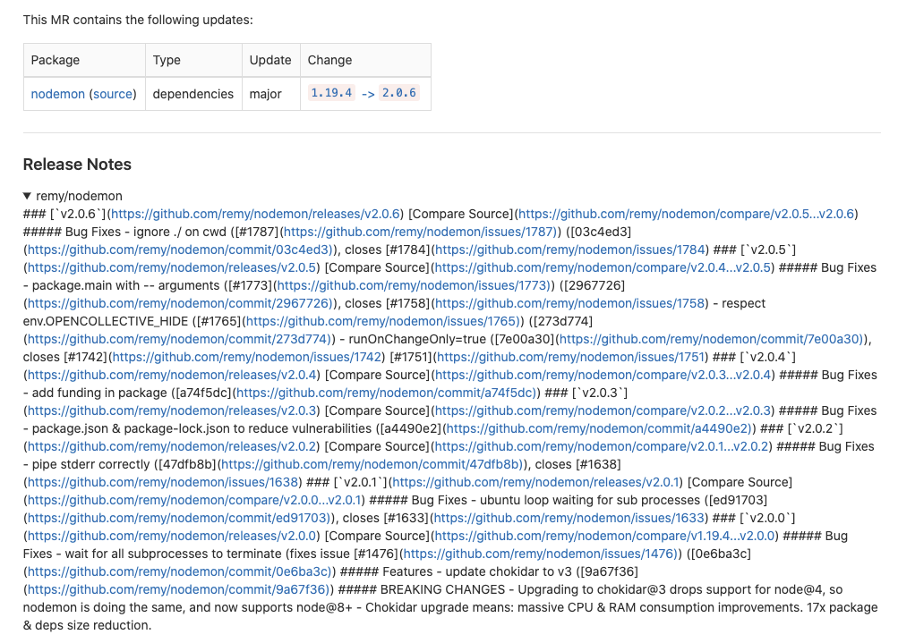
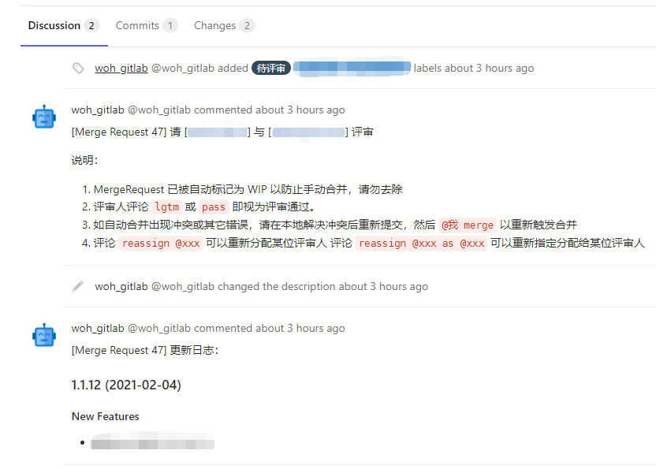

---

title: 'Integrate Renovate with GitLab'
date: 2020-11-09T12:49:56.979Z
tags: [ci]
---

<!-- 「」 -->

企业项目群中往往会有部分代码逻辑需要公用，将其抽离作为公共包发布到私有源的做法是比较优雅的解决方式。但是这么做的话后期需要面临一个问题：**当一个公共依赖包的使用者数量逐渐庞大的时候，如何保证当此包发布新版本时，所有使用者都能尽可能快地得到更新？**

传统的解决方案：

1. 手工对所有项目逐个升级。这种办法相当繁琐，且容易产生遗漏，当项目数量足够庞大的时候，发布一次将会时相当痛苦的体验；
2. 在依赖安装时指定版本为 `latest`。这种办法虽然能保证每次安装时都能得到最新版本，但是却有诸多弊端，如：
    1. 无法保证依赖的安全性，有可能一次更新不慎造成大面积的瘫痪；
    2. 对「依赖锁」不友好，如 `yarn.lock` 等。
    
因此，如何使这个过程变得优雅，是一个亟待解决的问题。

<!-- more -->

## 关于 Renovate

[Renovate](https://github.com/renovatebot/renovate) 是一个专注于解决依赖问题的库，使用 Node.js 编写，因此它也许会更适合于使用 NPM 或 Yarn 作为依赖管理的项目。我最早从 [zexo.dev/使用 renovate 监控第三方依赖更新](https://zexo.dev/posts/2020/03/01/keep-your-repo-dependencies-up-to-date-with-renovate) 这篇博文中得知了这个工具，在 GitHub 上托管的个人项目上尝试了一段时间后发现它非常好用。

## 如何工作？

复杂的流程就不讲了。总的来说，它会对启用了它的项目做以下几件事情：

1. 发起一个 Onboard PR，将它的配置文件以 PR 的形式合并到项目中。在这个 PR 被合并前，不会有任何后续操作。
2. 在 Onboard 被合并后，发起一个 Pin PR，将项目中用到的依赖的版本锁定，对于 `package.json` 来说，即去除任何模糊的通配符，如 `^` / `~` 等，改用精确的版本号。在这个 PR 被合并前，不会有任何后续操作。
3. Pin PR 被合并后，开始周期性地检索依赖。当发现有更新时，为每个依赖（或依赖群）更新发起一个 PR，内容包含依赖定义文件（如 `package.json`） 与依赖锁文件（如 `yarn.lock`）。
4. 如果用户想要做本次升级，将其合并即可。将来如果该依赖再次有更新可用，会再次生成新的 PR；
5. 如果用户不想做本次升级，将其关闭即可。Renovate 将忽略该版本，不再发起 PR。

以上只是大致流程，实际上 Renovate 还有非常多的配置项可以发掘，可以提供高度定制化的使用体验。

## 如何使用？

如果是在 GitHub 上使用，只需到应用市场安装 Renovate 并为它提供想要开启服务的项目的访问权限即可，过几分钟就能在项目内收到 Onboard PR。但这部分不是本文的重点。

本文重点是如何在私有环境中使用它，即 Self-hosted 环节，与我司的自建 GitLab 进行集成。

根据 [官方文档](https://github.com/renovatebot/renovate/blob/master/docs/usage/self-hosting.md)，自建 Renovate 服务有以下几种方式：

### 方式 1：`npm install -g renovate`

该方式最简便，只需要安装了 Node.js 环境以后，通过以上 cli 工具即可实现所有功能。但是官方文档对他的描述十分简略，几乎没有，勉强通过 `--help` 才试出了用法：

```bash
GITHUB_COM_TOKEN=your-github-token renovate \
    --platform=gitlab \
    --endpoint=https://gitlab.cpmpany.com/api/v4/ \
    --token=your-gitlab-token \
    --onboarding=true \
    --onboarding-config="{\"extends\": [\"config:base\"]}" \
    --log-level=debug \
    --yarnrc="registry \"http://npm-registry.cpmpany.com\"" \
    --npmrc="registry=\"http://npm-registry.cpmpany.com\"" \
    path/to/project
```

解释：

1. `GITHUB_COM_TOKEN` 是用来从 GitHub 上获取 Changelog 时要用到的。如果没有提供这个 token，则 Renovate 不会尝试去获取 Changelog；
2. `platform` / `endpoint` / `token` 分别对应目标平台的参数；
3. `onboarding` 表示项目必须先接受 Onboard PR 才会执行后续操作；
4. `onboarding-config` 为 Onboard PR 所提供的默认配置文件；
5. `log-level` 为 `debug` 时才能得到详细的日志，方便调试；
6. 项目内一般自带了 yarnrc 与 npmrc，如果项目内自带的已经覆盖了私有源则无需配置，否则需要配置。需要注意的是，如果使用 npm 则只需要提供 `npmrc`，但如果使用 yarn 则需要同时提供 `yarnrc` 与 `npmrc`，缺一不可。

命令行可以作为本地调试工具，最终部署的话还是直接使用打包好的镜像更好用一些。

### 方式2：使用 Docker 镜像

Renovate 提供了构建好的 [renovate/renovate](https://hub.docker.com/r/renovate/renovate/) 镜像，可以直接使用。

```bash
docker run --rm -v "/path/to/your/config.js:/usr/src/app/config.js" renovate/renovate
```

这个镜像有多个版本，其中大体区分为 `slim` 版与完整版。它们之间的区别是：

1. 完整版包含了所有可能要用到的构件工具，如 `Python` 等，约 1.3GB；
2. `slim` 版仅包含 Renovate 自身，约 130MB。

可以使用 GitLab CI 与该镜像直接集成，`image` 指定 `renovate/renovate` 即可。但是由于 Renovate 是一个需要持续周期性执行的任务，放置在 CI 中略显不合适。因此我选择使用 k8s 集成。

### 方式3：使用 Kubernetes

[官方文档](https://github.com/renovatebot/renovate/blob/master/docs/usage/self-hosting.md) 贴心地提供了 k8s 的配置样例，基本上复制粘贴就能完成配置了：

```yaml
apiVersion: v1
kind: Secret
metadata:
  name: renovate-env
type: Opaque
stringData:
  GITHUB_COM_TOKEN: 'any-personal-user-token-for-github-com-for-fetching-changelogs'
  # set to true to run on all repos you have push access to
  RENOVATE_AUTODISCOVER: 'false'
  RENOVATE_ENDPOINT: 'https://github.company.com/api/v3'
  RENOVATE_GIT_AUTHOR: 'Renovate Bot <bot@renovateapp.com>'
  RENOVATE_PLATFORM: 'github'
  RENOVATE_TOKEN: 'your-github-enterprise-renovate-user-token'
---
apiVersion: batch/v1beta1
kind: CronJob
metadata:
  name: renovate
spec:
  schedule: '@hourly'
  concurrencyPolicy: Forbid
  jobTemplate:
    spec:
      template:
        spec:
          containers:
            - name: renovate
              # Update this to the latest available and then enable Renovate on
              # the manifest
              image: renovate/renovate:23.19.2
              args:
                - user/repo
              # Environment Variables
              envFrom:
                - secretRef:
                    name: renovate-env
          restartPolicy: Never
```

但是，这里有一个地方比较坑的是，像 `RENOVATE_AUTODISCOVER` 这种环境变量的命名，官方并没有提供一个文档明确说明到底是以何种规则得到的（或者是我没有找到）。不过经过一番搜索，我找到了它的具体实现：

[lib/config/env.ts](https://github.com/renovatebot/renovate/blob/53ca91301f6a36c0c87e7d6b06b1bd8c9ec1b283/lib/config/env.ts):

```typescript{8-9}
export function getEnvName(option: Partial<RenovateOptions>): string {
  if (option.env === false) {
    return '';
  }
  if (option.env) {
    return option.env;
  }
  const nameWithUnderscores = option.name.replace(/([A-Z])/g, '_$1');
  return `RENOVATE_${nameWithUnderscores.toUpperCase()}`;
}
```

也就是，将普通配置名（驼峰命名）：

1. 全部转为大写字母；
2. 单词首字母前加上 `_`；
3. 前面加上 `RENOVATE_`

就得到了环境变量的命名。

但是，经过实践发现这里有一个特例：`logLevel` 这个配置并不是转换为 `RENOVATE_LOG_LEVEL`，而仅仅是 `LOG_LEVEL` 而已。 

另外，官方提供的样例对于所有 secrets 都使用了 `stringData` 来储存，不提倡这种做法。我建议将 `token` 类密钥信息做 base64 编码储存在 `data` 中：

```yaml
apiVersion: v1
kind: Secret
metadata:
  name: renovate-secret
type: Opaque
data:
  GITHUB_COM_TOKEN: ...
  RENOVATE_TOKEN: ...
stringData:
  RENOVATE_AUTODISCOVER: 'false'
  RENOVATE_ENDPOINT: 'https://gitlab.company.com/api/v4/'
  RENOVATE_PLATFORM: 'gitlab'
  RENOVATE_ONBOARDING: 'true'
  RENOVATE_ONBOARDING_CONFIG: '{...}'
  RENOVATE_SEMANTIC_COMMITS: 'enabled'
  RENOVATE_YARNRC: 'registry "http://npm-registry.company.com"'
  RENOVATE_NPMRC: 'registry="http://npm-registry.company.com"'
  LOG_LEVEL: 'debug'
```

## 集成 GitLab

在之前的博文 [Gitlab CE Code-Review Bot](/posts/2020-09-23-gitlab-ce-code-review-bot.html) 中，我介绍了 GitLab CE 评审机器人的实现。由于 Renovate 也是基于 Merge Request 实现的，因此它们能够很好地相处：

1. Renovate 发起 MR
2. 评审机器人随机分派评审人
3. 评审通过，合并

但是有几点需要注意：

1. 由于评审机器人使用了 `WIP` 来阻止 MR 被手动合并，因此 Renovate 的配置中也需要将 MR 设置为 draft 状态，这样才能维持 MR 的 `WIP` 标记。否则，Renovate 会在发起 MR 后的第二次扫描中尝试去除 MR 的 `WIP` 标记；
2. 最好给 Renovate 开设一个独立的账号。如果与其他用户或程序共用账号，Renovate 可能会在 force-push 的过程中使某些由其它用户做出的改动丢失；
3. 因为 Renovate 的设计中存在一些高危操作（分支删除，强制推送等），因此最好只赋予 Developer 权限。实际上如果不启用自动合并，它也只需要 Developer 权限。

符合我需求的最终配置 `renovate.json`：

```json5
{
  "extends": [
    "config:base",
    // 除了 peerDependencies 以外所有依赖都 pin
    ":pinAllExceptPeerDependencies"
  ],
  // 仅启用 npm 依赖管理，项目里有其它依赖项不想被 Renovate 管理的，
  // 如：Docker / Gradle / Cocoa Pod 等
  "enabledManagers": [
    "npm"
  ],
  // 仅对 @company/ 开头的私有包启用依赖管理，其它外部依赖一律禁用
  "packageRules": [
    {
      "packagePatterns": [
        "*"
      ],
      "excludePackagePatterns": [
        "^@company/"
      ],
      "enabled": false
    }
  ],
  // 将 MR 标记为 draft，即 WIP
  "draftPR": true
}
```

## 遇到的问题

1. 将 Renovate 部署上 Kubernetes 的时候，要注意能够分配的节点是否都有私有源的访问权限。如果 CronJob 被分配到了无权访问的节点会导致私有包 Lookup Failed，从而更新失败。如果只有部分节点拥有访问权限，可以用 `nodeSelector` 或 `nodeName` 指定节点；
1. Changelog 在 GitLab (10.3.2) 上面会丢失，并且格式错乱，如图所示：
   这个问题猜测是由于我司的 GitLab 版本过低导致的。因为 [gitlab.com](http://gitlab.com/) (13.x) 上不存在这个问题。但是因为 GitLab 不在我的管辖范围内，因此目前没有找到很好的解决方案，后续如果解决了会更新。

### 解决 Changelog 问题

我在 GitHub 上提了一个 [issue](https://github.com/renovatebot/renovate/issues/7689)，但是作者表示这是老版本 GitLab 出现的问题，建议升级 GitLab，不会为其做出改动及修复。不过他建议可以修改源码内的某些文件并自己构建一个 Docker 镜像来达到目的：

> You could perhaps try building your own image with a modified version of that file, or even just sed replace parts of it at runtime. You can find it at dist/workers/pr/changelog/hbs-template.js in the built/distributed version.

但是我不是很喜欢这种做法，这样的话会更新镜像会比较麻烦。不过如他所说，也可以选择在运行时进行替换。由于之前开发过一款 [评审机器人](/posts/2020-09-23-gitlab-ce-code-review-bot.html)，机器人的执行逻辑刚好适合用来做这一块的热修复。只需要在 MR 创建逻辑内加多一个判断，如果是来自 renovate 的 MR 则执行修复操作；

1. 解决格式错乱问题：读取 MR 的 `description` 字段，并将 `<details>` 节点去除；
2. 解决 changelog 丢失问题：调用 GitLab API 获取 Changelog，并粘贴到 `description` 中；
3. Renovate 更新 MR 时会丢失 `description` 中的更改，为了保险起见，再将 Changelog 作为输出到评论中去。

大致代码：

```javascript
if (isRenovateMR && enableRenovateFix) {
  try {
    // renovate 在旧版 gitlab 上有问题，此处为修复逻辑
    const { description } = object_attributes
    // 根据 mr 内容获取项目名与 tag 名
    // getStringBetween 函数：截取头尾字符串中间的内容
    const projectName = getStringBetween(description, '<summary>', '</summary>')
    const tagName = getStringBetween(description, '[Compare Source]', ')').split('...')[1]
    // 获取 release note
    const tag = await service.getTagInfo(projectName, tagName)
    const releaseNote = _.get(tag, 'release.description', '')
    // 移除 details 标签，并添加 release note
    const _desc = description.replace('<details>', '').replace('</details>', releaseNote)
    // 更新 mr 内容
    await service.updateMergeRequest(pid, mid, {
      description: _desc
    })
    // 添加评论
    if (!!releaseNote) {
      await service.addMergeRequestComment(pid, mid, `
更新日志：

${releaseNote}
`)
    }
  } catch (e) {
    console.error(e)
  }
}
```

效果如图所示：

