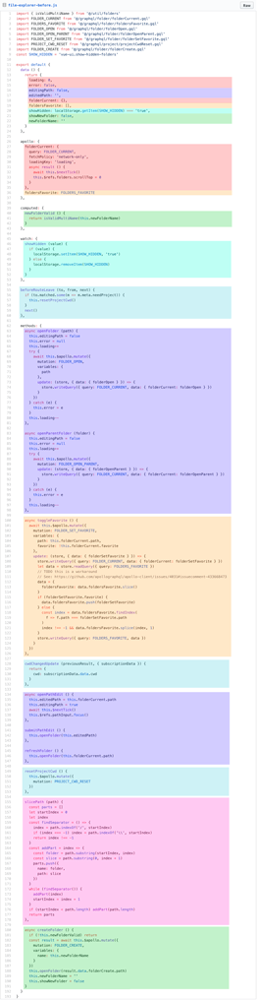
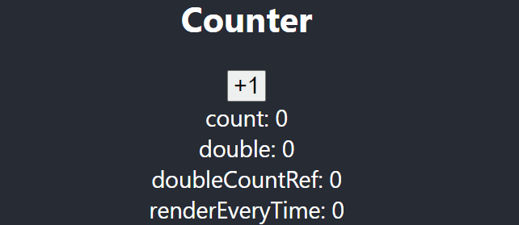
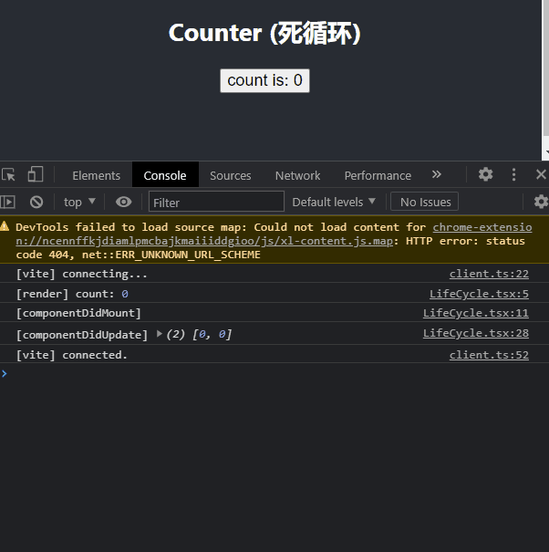

---

title: 'React Hooks vs. VCA'
date: 2021-07-28T09:18:04.925Z
tags: [javascript,react,vue,hooks]
---

<!-- 「」 -->

关于 hooks 与 VCA：

* React 16.8 新增了 [Hooks API](https://reactjs.org/docs/hooks-intro.html) （简称 hooks)
* Vue 3.0 新增了 [Composite API](https://v3.cn.vuejs.org/guide/composition-api-introduction.html) （简称 VCA）

二者为了共同的目的，在接近的时间点，以非常相似但是又带有本质区别的方式，推出了各自对于未来前端代码结构发展的新思路。本文在对二者做一些简单介绍的同时，也会重点关注二者之间的统一与区别。

<!-- more -->

## 先说结论

### 共同目的

#### 1. 优化代码复用

以下所说的代码复用，不包含组件复用等内容。两大框架老的复用方式存在的共同问题：

* 变量、参数来源不明确（混乱）；
* 无命名空间，变量之间可能冲突、覆盖（不可靠）；

**React**

* mixin

因为 mixin 的缺点根本多到数不清，[React mixin](https://reactjs.org/docs/react-without-es6.html#mixins) 是一种已经基本上被废弃了的写法。它在 class 组件中已经不可用了。

```typescript
const TickTock = React.createClass({
    mixins: [SetIntervalMixin], // Use the mixin
    // ...
});
```

* HOC

[HOC](https://reactjs.org/docs/higher-order-components.html) 是 Higher-Order Components 的简称。HOC 是通过语言自身的特性实现的，跟 React 本身没有关系。

```tsx
class AdvancedComp extends React.Component { 
  render() {
    return <BaseComp {...props} text={'someText'} />;
  }
}
```

HOC 是在 React Hooks 出现之前被广泛使用的代码复用方式，但是它存在自己的问题和局限性：

1. 不能在 `render` 函数内定义 HOC（会导致组件丢失状态，以及消耗性能）
2. 高阶组件会丢失原组件的静态与实例方法，需要手动复制
3. `ref` 将无法得到原始组件的引用，必须用 `React.forwardRef` 处理
4. 复杂的高阶组件跟 mixin 一样，存在参数来源以及去向混乱的问题

* 继承（不支持生命周期钩子）

继承这种方式，看起来很符合语言特性，但是 React 对它的支持是不完备的，甚至没有出现在官方推荐的方式里面。最主要的问题是，高阶组件没有办法复用基类的生命周期以及 render 函数，也不能通过形如 `super.componentDidMount()` 的形式来绕过这个问题。

```typescript
class AdvancedComp extends BaseComp {
  // ...
}
```

**Vue**

* Mixin

Vue 的 mixin 跟 React 非常类似，在提供便利的同时，同样带来了多到数不清的问题。摘录一下来自 Vue 官方文档的吐槽：

> 在 Vue 2 中，mixin 是将部分组件逻辑抽象成可重用块的主要工具。但是，他们有几个问题：
>
> 1. Mixin 很容易发生冲突：因为每个 mixin 的 property 都被合并到同一个组件中，所以为了避免 property 名冲突，你仍然需要了解其他每个特性。
>
> 2. 可重用性是有限的：我们不能向 mixin 传递任何参数来改变它的逻辑，这降低了它们在抽象逻辑方面的灵活性。

* Directive

Directive（指令）是一种特殊的代码复用，它的目的非常局限：操作 DOM 节点。也就是说，它的复用范围仅限于跟 DOM 操作相关的内容。


#### 2. 减轻心智负担

在以**职能**来组织代码的时候，当我们的组件开始变得更大时，**逻辑关注点**的列表也会增长，举例（一张来自 Vue 文档的图片）：



相信对于这类文件写过 Vue 的同学都深有体会。当我们需要查找跟某项功能相关的代码的时候，需要在文件中不停地搜索、上下跳动。非常难受。

#### 3. 干掉 `this`

`this` 在 JavaScript 这个大环境下始终存在指向不明确的问题，无论是对初学者还是资深前端工程师来说也始终是一个需要特别注意的地方，同时也不利于静态分析和强类型检查。

### 本质区别

二者的区别，说来非常简单，但是又非常巨大：

1. React Hooks 是 **effect**，在组件**每次渲染的时候都会执行**
2. VCA 是 **setup**，仅在组件初始化的时候**执行一次**

这些区别具体代表了什么，需要在下文继续阐释。

## 常用场景差异

### 生命周期

Hooks 移除了生命周期的概念，取而代之的是 [effect](https://reactjs.org/docs/hooks-effect.html) ，VCA 则近乎完整地保留了生命周期概念与函数。

#### 1. Mount / Unmount

**hooks**

React Hooks 摒弃了 mount / unmount / update 等生命周期概念，转而引入了一个新的 [useEffect](https://reactjs.org/docs/hooks-effect.html) 函数，简而言之：

1. `useEffect` 接收两个参数，第一个是回调函数 `callback`，第二个是数组 `deps`
2. `callback` 可以没有返回值，也可以返回一个函数，如果返回了函数，那将会是这个 effect 的「清除」函数
3. 当组件初次挂载，或者每当 `deps` 里面的任意一个元素发生变化的时候（这个时机由 React 判断），回调函数将会被执行一次
4. 特殊情况：
   1. `deps` 未传：`callback` 在每次渲染的时候都会执行一次
   2. `deps` 为空数组：`callback` 当且仅当组件第一次挂载的时候执行一次

因此，可以使用 `useEffect` 同时模拟 mount 与 unmount 事件：

```tsx
// componentDidMount (mounted)
useEffect(() => {
  console.log('[componentDidMount]')

  const clicked = (e: MouseEvent) => {
    setXy([e.clientX, e.clientY])
  }

  document.addEventListener('click', clicked)

  // componentWillUnmount (beforeUnmount)
  return () => {
    console.log('[componentWillUnmount]')
    document.removeEventListener('click', clicked)
  }
}, [])
```

这样做有几个好处：

1. 对于通常需要成对出现的，类似注册、解注册的逻辑来说，这么做可以使得逻辑更加内聚
2. 挂载和卸载函数可以读取到同一个作用域下的变量和方法，就比如以上例子中的 `clicked` 事件

但是，由此也带来了一个显而易见的问题：`callback` 没法使用 `async` 函数了。因为 `async` 函数必定会返回一个 `Promise` 实例，而这明显与设计相悖。想要在 `useEffect` 内部使用 `async` 函数的话，做法会有点绕：

```typescript
useEffect(() => {
  (async () => {
    // do something...
  })()
})
```

**vca**

与 Hooks 大相庭径：

1. VCA 保留了传统的 mounted 与 unmount 事件，只不过换了个形式
2. VCA 不需要写 `deps`

```typescript
export default defineComponent({
  setup () {
    const xy = reactive({
      x: 0,
      y: 0
    })

    const clicked = (e: MouseEvent) => {
      xy.x = e.clientX
      xy.y = e.clientY
    }

    onMounted(() => {
      document.addEventListener('click', clicked)
    })

    onBeforeUnmount(() => {
      document.removeEventListener('click', clicked)
    })

    return {xy}
  },
})
```

#### 2. Update / Watch

**hooks**

当 `useEffect` 的 `deps` 不为空时，回调函数在组件第一次挂载时，以及后续每次 `deps` 的其中之一变化时都会执行。

这里有一点需要注意的是：**除 `useRef` 以及 `useState` 的 setter 以外，其它所有回调函数中用到的变量，都需要写进 `deps`**，包括 `state` / `memo` / `callback` 等，否则（因为闭包的存在）函数调用时永远会拿到旧的值。

```tsx
// componentDidUpdate (watch / updated)
useEffect(() => {
  console.log('[componentDidUpdate]', xy)
}, [xy])

// 错误！fetchData 也需要写进 deps
useEffect(() => {
  // useRef
  console.log(countRef.current)
  // useCallback useState
  fetchData(page)
}, [page])
```

**vca**

VCA 的 updated 与 watch 与原 API 也基本类似，但是有几个需要注意的点：

1. 增加了一个新的概念 `watchEffect`，与 `useEffect` 十分类似，但是不需要写 `deps`！
2. `watch` 与 `watchEffect` 都**不能**直接监听 `reactive` 本身——因为只有 reactive 下面的属性才是真正意义上的 reactive

```typescript
onUpdated(() => {
  console.log('updated', xy)
})

// 正确
watch(() => xy.y, (y, oy) => {
  console.log('watch',y, oy)
})

// 错误，两个参数都将是更新后的值
watch(xy, (y, oy) => {
  console.log('watch',y, oy)
})

// 正确
watchEffect(() => {
  console.log('watchEffect', xy.y)
})

// 错误，无法触发
watchEffect(() => {
  console.log('watchEffect', xy)
})
```

### 变量定义

总体区别：

* hooks 内原则上不允许直接定义任何变量，包括常量、方法等，因为**组件每次渲染时都会重新初始化**。因此从某种意义上来说，直接定义的变量也是一种响应式变量（当能够正确赋予初始值的时候）。
* VCA 无此限制。并且直接定义的变量为常量。

#### 1. 变量

**hooks**

hooks 大致提供了以下几种定义变量的方法：

* `useState`: 响应式变量，不需要 `deps`
* `useMemo`: 常量（不可变）或计算值，需要写 `deps`
* `useRef`: 变量（可改变，但不影响渲染），不需要 `deps`
* 直接定义: 通常来说是错误的写法

```tsx
// state， 影响渲染
const [count, setCount] = useState(0)

// 计算属性，count 发生变化时会改变，影响渲染
const doubleCount = useMemo(() => count * 2, [count])

// 变量，但不影响渲染
const doubleCountRef = useRef(count * 2)

// 直接定义，每次渲染时都会重新计算值，因此也能影响渲染
const renderEveryTime = count * 2
```



**vca**

VCA 提供了以下几种定义变量的方法：

* `ref`: 基础类型，之所以存在，是因为基础类型目前来说无法做到响应式，所以必须通过一个对象来包裹，通过 `xxx.value` 访问基础类型才能获得响应式
* `reactive`: 复杂类型，对象与数组
* `computed`: 计算值
* 直接定义: 常量

无论哪种方式，VCA 都不需要写 deps

```typescript
// state， 影响渲染
const count = ref(0)

// 计算属性，count 发生变化时会改变，影响渲染
const double = computed(() => count.value * 2)

// 常量，一次性的值，不影响渲染
const doubleCountRef = count.value * 2;
```


#### 2. 方法

**hooks**

* 方法定义必须使用 `useCallback` 包裹，某则每次渲染都会被重新创建。
* 方法必须正确定义 `deps`，否则内部取值将得不到变化后的值
* 方法的 `deps` 一旦改变，方法将会被重新创建，闭包也会得到更新

```typescript
const [count, setCount] = useState(0)

// 正确
const addCount = useCallback(() => {
  setCount(v => ++v)
}, [])

// 正确
const addCount = useCallback(() => {
  setCount(count + 1)
}, [count])

// 错误, 永远相当于 setCount(0 + 1)
const addCount = useCallback(() => {
  setCount(count + 1)
}, [])
```

**vca**

没什么限制，可以随心所欲。

```typescript
const addCount = function () {
  ++count.value
}
```

### 代码复用

二者在代码复用这一块的理念十分类似，最终体现在代码上就像是两兄弟。

**hooks**

```tsx
import React, { useEffect, useState, memo } from 'react'

function useMousePosition () {
  const [xy, setXy] = useState([0, 0])
  useEffect(() => {
    const moved = (e: MouseEvent) => {
      setXy([e.clientX, e.clientY])
    }

    document.addEventListener('mousemove', moved)

    return () => {
      document.removeEventListener('mousemove', moved)
    }
  }, [])

  return {
    x: xy[0],
    y: xy[1]
  }
}

export default memo(
  function () {
    const { x, y } = useMousePosition()

    return (
      <>
        <h2>CustomHooks</h2>
        <div>Mouse Position: {x},{y}</div>
      </>
    )
  }
)
```


**vca**

```typescript
function useMousePosition () {
  const xy = reactive({ x: 0, y: 0 })
  const moved = (e: MouseEvent) => {
    xy.x = e.clientX
    xy.y = e.clientY
  }

  onMounted(() => {
    document.addEventListener('mousemove', moved)
  })

  onBeforeUnmount(() => {
    document.removeEventListener('mousemove', moved)
  })

  return xy
}

export default defineComponent({
  setup () {
    const xy = useMousePosition()

    return { xy }
  },
})
```


## 存在的问题

简单来说，由于两个框架各自的特性，问题也通常来自于：

1. deps (hook)
2. Proxy (VCA)

不过有一个好消息是，React 提供了一个插件 [eslint-plugin-react-hooks](https://www.npmjs.com/package/eslint-plugin-react-hooks) 可以帮忙检测 deps 的缺失，并且后续有计划通过代码静态分析去除掉这个烦人的依赖项。

### Hook: 忘记写 deps 导致变量不更新

```typescript
// state
const [count, setCount] = useState(0)

// method
const addCount = useCallback(() => {
  setCount(count + 1)
}, [])
```


### Hook: Deps 写不好导致死循环

#### 案例一：在 setState 的同时又依赖了 state

常见于列表加载：

1. 首页数据可以直接 `setState`
2. 后续分页的数据要在现有基础上追加

```typescript
const [count, setCount] = useState(0)

const addCount = useCallback(() => {
  setCount(count + 1)
}, [count])

useEffect(() => {
  addCount()
}, [addCount])
```



#### 案例二： useEffect 忘记写 deps

```typescript
const addCount = useCallback(() => {
  setCount(v => v + 1)
}, [])

useEffect(() => {
  addCount()
})
```

#### 案例三：deps 里面填入了直接定义的变量

```typescript
let someValue = []
const [count, setCount] = useState(0)

useEffect(() => {
setCount(v => ++v)
}, [someValue])
```

### Hooks: 不能在条件和循环体内定义 hook

因为 Hooks 的实现原理是链表，必须保证每次组件渲染得到的 hooks 及其顺序都是一致的。

```typescript
// 错误的写法，会直接报错
const [count, setCount] = useState(0)

if (count === 1) {
  const [double, doubleCount] = useState(count)
}
```

### VCA: 解构丢失响应性

包括 `props` / `reactive` 在内的所有 Proxy 类型变量都不能解构，否则会丢失响应性。解构必须使用 `toRefs` 方法

```typescript
export default defineComponent({
  setup () {
    const count = reactive({ value: 0 })

    const addCount = function () {
      ++count.value
    }
    const { value } = count

    return { count, value, addCount }
  },
})
```


## 总结

### React Hooks

优点：

* 目前为止最好的代码复用方式（之一）
* 优秀且精炼的设计理念

缺点：

* 需要写 `deps`
* 每次渲染都执行带来的额外心智负担

### Vue Composite API

优点：

* 目前为止最好的代码复用方式（之一）
* 作为 setup，上手难度相较 hooks 可谓是极低，心智负担极低

缺点：

* 与 Hooks 相比，API 设计（也许）不够精炼，受制于历史包袱
* Proxy 虽然带来了便利，但是也带来了麻烦，经常需要考虑：
  * 一个对象能否解构？
  * 一个属性到底应该用 `ref` 还是 `reactive`？
  * 取值的时候要不要加 `.value`（常常被忘记）？
